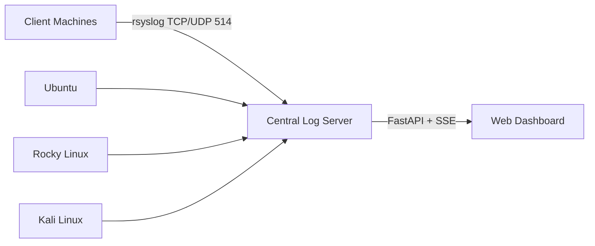

# Centralized Log Monitoring System


## Overview

This project provides a centralized log monitoring solution that collects logs from multiple Linux machines (clients) to a central RHEL server, then visualizes them in a real-time Next.js web dashboard. The system consists of three main components:

1. **Log Server (RHEL)**: Receives and stores logs from multiple clients
2. **Clients (Ubuntu, Rocky Linux, Kali)**: Send system logs to the server
3. **Web Dashboard (Next.js)**: Displays logs in real-time with filtering and statistics

## Architecture



## Features

- 📊 Real-time log streaming from multiple hosts
- 🔍 Automatic severity classification (error, warning, info, debug)
- 🖥️ Host-based filtering
- 🔎 Full-text search across log messages
- 📈 Comprehensive statistics dashboard
- 📱 Fully responsive design
- 💾 Persistent log storage in `/var/log/remote`
- ⚙️ Systemd service for automatic startup
- 🔄 Server-Sent Events (SSE) for live updates

## Prerequisites

### Log Server (RHEL)

- RHEL 8/9
- Python 3.7+
- rsyslog
- Firewall access (ports 514/tcp, 514/udp, 8000/tcp)

### Client Machines

- Ubuntu/Rocky/Kali Linux
- rsyslog installed
- Network access to log server

### Dashboard Host

- Node.js 16+
- Modern web browser

## Project Structure

```
logs-server/
├── src/                    # Next.js frontend source
├── public/                 # Static assets
│   └── screenshot.png      # Dashboard screenshot
├── server_configuration/   # Server config files
│   ├── logs_server.service # Systemd service file
│   ├── main.py             # FastAPI server
│   └── rsyslog.conf        # rsyslog configuration
└── README.md               # This documentation
```

## Installation

### 1. Log Server Setup (RHEL)

1. Install required packages:

```bash
sudo dnf install rsyslog python3-pip -y
```

2. Configure rsyslog (use the provided `rsyslog.conf` from `server_configuration/`):

```bash
sudo cp server_configuration/rsyslog.conf /etc/rsyslog.conf
```

3. Create log directory and set permissions:

```bash
sudo mkdir -p /var/log/remote
sudo chmod -R 755 /var/log/remote
sudo systemctl restart rsyslog
```

4. Configure firewall:

```bash
sudo firewall-cmd --permanent --add-port=514/tcp
sudo firewall-cmd --permanent --add-port=514/udp
sudo firewall-cmd --permanent --add-port=8000/tcp
sudo firewall-cmd --reload
```

5. Install Python dependencies:

```bash
pip install fastapi uvicorn
```

6. Set up FastAPI service:

```bash
sudo mkdir -p /root/logs_server
sudo cp server_configuration/main.py /root/logs_server/main.py
```

7. Configure systemd service (use provided `logs_server.service`):

```bash
sudo cp server_configuration/logs_server.service /etc/systemd/system/
sudo systemctl daemon-reload
sudo systemctl enable logs_server.service
sudo systemctl start logs_server.service
```

### 2. Client Machine Setup

For each client machine (Ubuntu/Rocky/Kali):

1. Install rsyslog if needed:

```bash
# Ubuntu/Debian:
sudo apt install rsyslog -y

# Rocky/RHEL:
sudo dnf install rsyslog -y
```

2. Configure log forwarding (replace `SERVER_IP` with your RHEL server's IP):

```bash
echo '*.* @@SERVER_IP:514' | sudo tee -a /etc/rsyslog.conf
sudo systemctl restart rsyslog
```

### 3. Web Dashboard Setup

1. Clone the repository:

```bash
git clone https://github.com/NidhalChelhi/logs-server.git
cd logs-server
```

2. Install dependencies:

```bash
npm install
```

3. Configure environment:

```bash
echo "NEXT_PUBLIC_LOG_SERVER_URL=http://SERVER_IP:8000" > .env.local
```

4. Run the development server:

```bash
npm run dev
```

For production:

```bash
npm run build
npm run start
```

## Configuration Details

### Server Configuration (`main.py`)

Key configuration parameters:

```python
LOG_DIR = Path("/var/log/remote")  # Log storage directory
SERVER_HOSTNAME = "rhel"           # Server's hostname (excluded from logs)
PORT = 8000                        # FastAPI server port
```

### rsyslog Configuration

Main features in `rsyslog.conf`:

- TCP/UDP reception on port 514
- Log storage by hostname in `/var/log/remote/%HOSTNAME%.log`
- Standard system log handling
- Cron log filtering

### Systemd Service

Key service parameters:

- Runs as root (required for log access)
- Automatic restarts on failure
- Security restrictions applied
- Log directory access permissions

## Usage

1. Access the dashboard at `http://localhost:3000` (or your server's IP if deployed)
2. Use the interface controls:
   - **Search**: Filter logs by content
   - **Host Filter**: Select specific machines
   - **Severity Filter**: Show only errors, warnings, etc.
3. View real-time statistics in the dashboard

## Troubleshooting

### Common Issues

**Logs not appearing in dashboard:**

```bash
# Verify rsyslog is running on clients
sudo systemctl status rsyslog

# Check server connectivity
telnet SERVER_IP 514

# Inspect server logs
sudo tail -f /var/log/remote/*.log

# Check API service status
sudo journalctl -u logs_server.service -f
```

**Performance Optimization:**

- Adjust in-memory log limit (`slice(-500)` in frontend code)
- Increase stats update interval (currently 30s)
- Limit log age with `minutes` API parameter

## Security Considerations

⚠️ **Important Security Notes:**

1. **Current Limitations**:

   - No authentication implemented
   - Service runs as root (required for log access)
   - Plain TCP/UDP used for log transmission

2. **Recommended Enhancements**:
   - Implement TLS for rsyslog communication
   - Add Basic Auth or JWT for API access
   - Configure firewall restrictions
   - Consider non-root operation with proper permissions

## Roadmap

Planned improvements:

- [ ] Add user authentication
- [ ] Implement database persistence
- [ ] Create alerting/notification system
- [ ] Add log rotation/archiving
- [ ] Dockerize all components
- [ ] Implement TLS encryption

## License

MIT License

## Contributors

- [Mohamed Ghaith Hamzaoui](https://github.com/ghaithhamzaoui)
- [Nidhal Chelhi](https://github.com/nidhalchelhi)

---

For support or contributions, please open an issue on the [GitHub repository](https://github.com/NidhalChelhi/logs-server).
